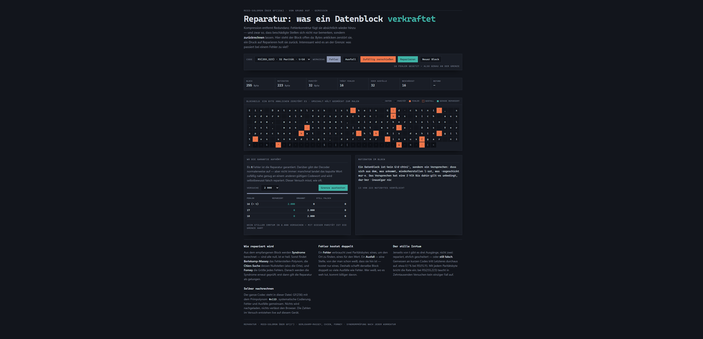

# Reparatur

Reed-Solomon über GF(256) von Grund auf — und die Frage, die in Erklärungen fast immer
fehlt: **was passiert bei einem Fehler zu viel?**

Der Datenblock liegt offen da. Bytes anklicken zerstört sie, ein Druck auf *Reparieren*
rechnet sie zurück. Interessant wird es an der Grenze.

### → [Öffnen](https://ssims437.github.io/reparatur/)

Eine einzelne HTML-Datei. Kein Build, keine Abhängigkeit, nichts verlässt den Browser.

---

## Drei Ausgänge, nicht zwei

Jede Einführung sagt: „korrigiert bis zu t Fehler". Das stimmt, verschweigt aber, dass es
jenseits von t nicht einen, sondern **zwei** Ausgänge gibt:

- **erkannt** — der Decoder gibt auf. Ehrlich und harmlos.
- **still falsch** — das beschädigte Wort liegt zufällig nahe genug an einem *anderen*
  gültigen Codewort. Der Decoder repariert selbstbewusst auf das falsche Ergebnis und
  meldet Erfolg. Die Syndromprüfung danach schlägt nicht an, weil das Ergebnis ein
  gültiges Codewort *ist* — nur nicht das gesendete.

Wie oft das vorkommt, hängt scharf von der Parität ab. Gemessen bei genau t+1 Fehlern,
je 20 000 Versuche:

| Code | t | still falsch | Anteil |
|---|---|---|---|
| RS(15,11) | 2 | 20 | **0,100 %** |
| RS(20,14) | 3 | 0 | — |
| RS(31,23) | 4 | 1 | 0,005 % |
| RS(63,51) | 6 | 0 | — |
| RS(127,107) | 10 | 0 | — |
| RS(255,223) | 16 | 0 | — |

Bei kurzen Codes trifft man den stillen Irrtum in Minuten. Bei RS(255,223) — dem Code aus
Compact Disc und Deep-Space-Telemetrie — taucht er in Zehntausenden Versuchen nicht
einmal auf. Die Größenordnung passt zu `C(n,t)·(q−1)^t / q^(n−k)`: für RS(15,11) ergibt
das 0,16 %, gemessen 0,100 %.

Die Seite misst das live auf dem eigenen Gerät, statt es zu behaupten. RS(15,11) mit
10 000 Versuchen je Stufe braucht rund 300 ms.

## Fehler kostet doppelt

Ein **Fehler** verbraucht zwei Paritätsbytes: eines, um den Ort zu finden, eines für den
Wert. Ein **Ausfall** — eine Stelle, von der man schon weiß, dass sie hin ist — kostet
nur eines. Derselbe Block trägt deshalb `2t` Ausfälle statt `t` Fehler. Beides lässt
sich nebeneinander ausprobieren; das Werkzeug schaltet um.

## Was drinsteckt

| Teil | Was es tut |
|---|---|
| GF(256) | Primpolynom `0x11D`, Log-/Exp-Tabellen |
| `encode` | systematisch, Generator mit den Wurzeln α¹…α^2t |
| `syndromes` | S[j] = C(α^{j+1}) |
| `bm` | Berlekamp-Massey, Lehrbuchform, aufsteigende Polynome |
| `chien` | Nullstellensuche → Fehlerorte |
| `forney` | Fehlerwerte, Ableitung in Charakteristik 2 |
| `decode` | Fehler und Ausfälle gemeinsam, mit Syndromprüfung danach |

Konvention durchgehend: Codewort `c[0..n-1]`, `c[n-1]` ist der konstante Term, Stelle `p`
entspricht dem Exponenten `n-1-p`.

## Was mich das gekostet hat

- **Drei Konventionen vermischt.** Die erste Fassung reparierte bei *einem* Fehler nur
  7 von 2000 — Syndrom-Indizierung mit und ohne führende Null, zwei Ableitungsvarianten,
  eine tote Korrekturfunktion neben der benutzten. Neu geschrieben mit einer einzigen
  durchgehenden Konvention war es auf Anhieb exakt.
- **Die fehlende Verschiebung bei Ausfällen.** Berlekamp-Massey muss auf den
  Forney-Syndromen **ab Index e** laufen, nicht ab 0. Ohne das hält BM die von den
  bekannten Ausfällen erzeugten Terme für echte Fehler. Verräterisches Muster: bei
  *voller* Kapazität (32 Ausfälle) klappte es, bei *weniger* nicht.
- **Wiederhergestellter Formularzustand.** Chrome stellt beim Neuladen die zuletzt
  gewählte Option wieder her; mein Zustand startete hart auf RS(63,51). Die Seite rechnete
  also mit einem anderen Code, als sie anzeigte. Der Zustand wird jetzt aus dem
  Auswahlfeld gelesen.

## Lizenz

[MIT](LICENSE)

[Redundanz](https://github.com/ssims437/redundanz) ist dieselbe Größe mit umgekehrtem
Vorzeichen: Kompression entfernt, was Fehlerkorrektur absichtlich hinzufügt.

Alle fünfzehn Blätter, nach Feld geordnet: **[ssims437.github.io](https://ssims437.github.io/)**
